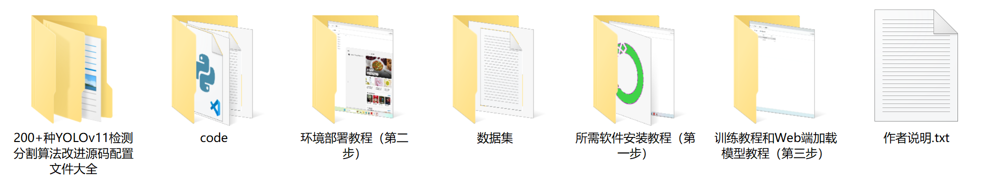

### 1.背景意义

研究背景与意义

随着教育信息化的不断推进，课堂教学环境中的学生行为识别技术逐渐受到重视。传统的课堂管理方式往往依赖于教师的主观判断，难以实现对学生行为的全面、客观分析。近年来，计算机视觉技术的快速发展为课堂行为识别提供了新的解决方案。基于深度学习的目标检测算法，尤其是YOLO（You Only Look Once）系列，因其高效的实时处理能力和较高的准确率，成为了该领域的研究热点。

本研究旨在基于改进的YOLOv11算法，构建一个能够实时识别课堂学生性别及其行为的系统。该系统不仅能够识别学生的性别（男孩和女孩），还能够对其行为进行分类，包括阅读、写作、睡眠等多种状态。通过对不同性别学生在课堂上的行为进行分析，可以为教师提供更为精准的课堂管理策略，帮助其及时调整教学方法，提高教学效果。

为实现这一目标，本研究采用了一个包含14个类别的多样化数据集，涵盖了不同性别和行为的学生图像。这些数据的多样性和丰富性为模型的训练提供了良好的基础，能够有效提升识别的准确性和鲁棒性。此外，数据集中包含的青少年和儿童行为特征，能够帮助研究者深入理解不同年龄段学生在课堂上的表现，为后续的教育研究提供数据支持。

通过对课堂学生性别行为的识别，不仅能够促进教育公平，还能够为个性化教育提供数据依据。未来，基于该系统的研究成果有望推动教育领域的智能化发展，为教师和学生之间的互动提供更为科学的支持。

### 2.视频效果

[2.1 视频效果](https://www.bilibili.com/video/BV1XhU5YZEDK/)

### 3.图片效果


##### [项目涉及的源码数据来源链接](https://kdocs.cn/l/cszuIiCKVNis)**

注意：本项目提供训练的数据集和训练教程,由于版本持续更新,暂不提供权重文件（best.pt）,请按照6.训练教程进行训练后实现上图演示的效果。

### 4.数据集信息

##### 4.1 本项目数据集类别数＆类别名

nc: 14
names: ['boy', 'girl', 'reading', 'scarf', 'sleeping', 'teen_boy', 'teen_girl', 'teen_reading', 'teen_sleeping', 'teen_turned_around', 'teen_writing', 'tenn_girl', 'turned_around', 'writing']


该项目为【目标检测】数据集，请在【训练教程和Web端加载模型教程（第三步）】这一步的时候按照【目标检测】部分的教程来训练

##### 4.2 本项目数据集信息介绍

本项目数据集信息介绍

本项目旨在改进YOLOv11模型，以实现课堂学生性别及行为的精准识别。为此，我们构建了一个专门的数据集，主题为“people_counter”，该数据集涵盖了14个类别，旨在全面捕捉学生在课堂环境中的多样行为和性别特征。数据集中包含的类别包括：男孩（boy）、女孩（girl）、阅读（reading）、围巾（scarf）、睡觉（sleeping）、青少年男孩（teen_boy）、青少年女孩（teen_girl）、青少年阅读（teen_reading）、青少年睡觉（teen_sleeping）、青少年转身（teen_turned_around）、青少年写作（teen_writing）、女孩（tenn_girl）、转身（turned_around）以及写作（writing）。这些类别的设计旨在反映课堂环境中学生的典型行为模式和性别特征，为模型的训练提供丰富的样本。

数据集的构建过程经过精心设计，确保涵盖不同年龄段和性别的学生行为，以提高模型的泛化能力和准确性。通过对不同场景的多样化采集，我们确保了数据集的代表性，使其能够有效反映真实课堂中的动态情况。每个类别的样本均经过标注，确保数据的高质量和可用性。此数据集不仅为模型提供了必要的训练数据，还为后续的评估和优化提供了坚实的基础。

在训练过程中，数据集将被用于增强YOLOv11模型的识别能力，使其能够准确区分不同性别和行为的学生。这将有助于教育工作者更好地理解课堂动态，并为个性化教学提供数据支持。通过这一项目，我们期望能够推动课堂行为识别技术的发展，为教育领域带来新的变革。


### 5.全套项目环境部署视频教程（零基础手把手教学）

[5.1 所需软件PyCharm和Anaconda安装教程（第一步）](https://www.bilibili.com/video/BV1BoC1YCEKi/?spm_id_from=333.999.0.0&vd_source=bc9aec86d164b67a7004b996143742dc)


[5.2 安装Python虚拟环境创建和依赖库安装视频教程（第二步）](https://www.bilibili.com/video/BV1ZoC1YCEBw?spm_id_from=333.788.videopod.sections&vd_source=bc9aec86d164b67a7004b996143742dc)

### 6.改进YOLOv11训练教程和Web_UI前端加载模型教程（零基础手把手教学）

[6.1 改进YOLOv11训练教程和Web_UI前端加载模型教程（第三步）](https://www.bilibili.com/video/BV1BoC1YCEhR?spm_id_from=333.788.videopod.sections&vd_source=bc9aec86d164b67a7004b996143742dc)


按照上面的训练视频教程链接加载项目提供的数据集，运行train.py即可开始训练



     Epoch   gpu_mem       box       obj       cls    labels  img_size
     1/200     20.8G   0.01576   0.01955  0.007536        22      1280: 100%|██████████| 849/849 [14:42<00:00,  1.04s/it]
               Class     Images     Labels          P          R     mAP@.5 mAP@.5:.95: 100%|██████████| 213/213 [01:14<00:00,  2.87it/s]
                 all       3395      17314      0.994      0.957      0.0957      0.0843

     Epoch   gpu_mem       box       obj       cls    labels  img_size
     2/200     20.8G   0.01578   0.01923  0.007006        22      1280: 100%|██████████| 849/849 [14:44<00:00,  1.04s/it]
               Class     Images     Labels          P          R     mAP@.5 mAP@.5:.95: 100%|██████████| 213/213 [01:12<00:00,  2.95it/s]
                 all       3395      17314      0.996      0.956      0.0957      0.0845

     Epoch   gpu_mem       box       obj       cls    labels  img_size
     3/200     20.8G   0.01561    0.0191  0.006895        27      1280: 100%|██████████| 849/849 [10:56<00:00,  1.29it/s]
               Class     Images     Labels          P          R     mAP@.5 mAP@.5:.95: 100%|███████   | 187/213 [00:52<00:00,  4.04it/s]
                 all       3395      17314      0.996      0.957      0.0957      0.0845


###### [项目数据集下载链接](https://kdocs.cn/l/cszuIiCKVNis)

### 7.原始YOLOv11算法讲解


###### YOLOv11改进方向

与YOLOv 10相比，YOLOv 11有了巨大的改进，包括但不限于：

  * 增强的模型结构：模型具有改进的模型结构，以获取图像处理并形成预测
  * GPU优化：这是现代ML模型的反映，GPU训练ML模型在速度和准确性上都更好。
  * 速度：YOLOv 11模型现在经过增强和GPU优化以用于训练。通过优化，这些模型比它们的前版本快得多。在速度上达到了25%的延迟减少！
  * 更少的参数：更少的参数允许更快的模型，但v11的准确性不受影响
  * 更具适应性：更多支持的任务YOLOv 11支持多种类型的任务、多种类型的对象和多种类型的图像。

###### YOLOv11功能介绍

Glenn Jocher和他的团队制作了一个令人敬畏的YOLOv 11迭代，并且在图像人工智能的各个方面都提供了YOLO。YOLOv 11有多种型号，包括：

  * 对象检测-在训练时检测图像中的对象
  * 图像分割-超越对象检测，分割出图像中的对象
  * 姿态检测-当用点和线训练时绘制一个人的姿势
  * 定向检测（OBB）：类似于对象检测，但包围盒可以旋转
  * 图像分类-在训练时对图像进行分类

使用Ultralytics Library，这些模型还可以进行优化，以：

  * 跟踪-可以跟踪对象的路径
  * 易于导出-库可以以不同的格式和目的导出
  * 多场景-您可以针对不同的对象和图像训练模型

此外，Ultralytics还推出了YOLOv 11的企业模型，该模型将于10月31日发布。这将与开源的YOLOv
11模型并行，但将拥有更大的专有Ultralytics数据集。YOLOv 11是“建立在过去的成功”的其他版本的之上。

###### YOLOv11模型介绍

YOLOv 11附带了边界框模型（无后缀），实例分割（-seg），姿态估计（-pose），定向边界框（-obb）和分类（-cls）。

这些也有不同的尺寸：纳米（n），小（s），中（m），大（l），超大（x）。


YOLOv11模型

###### YOLOv11与前版本对比

与YOLOv10和YOLOv8相比，YOLOv11在Ultralytics的任何帖子中都没有直接提到。所以我会收集所有的数据来比较它们。感谢Ultralytics：

**检测：**


YOLOv11检测统计


YOLOv10检测统计

其中，Nano的mAPval在v11上为39.5，v10上为38.5；Small为47.0 vs 46.3，Medium为51.5 vs
51.1，Large为53.4 vs 53.2，Extra Large为54.7vs
54.4。现在，这可能看起来像是一种增量增加，但小小数的增加可能会对ML模型产生很大影响。总体而言，YOLOv11以0.3
mAPval的优势追平或击败YOLOv10。

现在，我们必须看看速度。在延迟方面，Nano在v11上为1.55 , v10上为1.84，Small为2.46 v2.49，Medium为4.70
v4.74，Large为6.16 v7.28，Extra Large为11.31
v10.70。延迟越低越好。YOLOv11提供了一个非常低的延迟相比，除了特大做得相当差的前身。

总的来说，Nano模型是令人振奋的，速度更快，性能相当。Extra Large在性能上有很好的提升，但它的延迟非常糟糕。

**分割：**


YOLOV11 分割统计


YOLOV9 分割统计


YOLOV8 分割数据

总体而言，YOLOv 11上的分割模型在大型和超大型模型方面比上一代YOLOv 8和YOLOv 9做得更好。

YOLOv 9 Segmentation没有提供任何关于延迟的统计数据。比较YOLOv 11延迟和YOLOv 8延迟，发现YOLOv 11比YOLOv
8快得多。YOLOv 11将大量GPU集成到他们的模型中，因此期望他们的模型甚至比CPU测试的基准更快！

姿态估计：


YOLOV11姿态估计统计


YOLOV8姿态估计统计

YOLOv 11的mAP 50 -95统计量也逐渐优于先前的YOLOv 8（除大型外）。然而，在速度方面，YOLOv
11姿势可以最大限度地减少延迟。其中一些延迟指标是版本的1/4！通过对这些模型进行GPU训练优化，我可以看到指标比显示的要好得多。

**定向边界框：**


YOLOv11 OBB统计


YOLOv8 OBB统计

OBB统计数据在mAP
50上并不是很好，只有非常小的改进，在某种程度上小于检测中的微小改进。然而，从v8到v11的速度减半，这表明YOLOv11在速度上做了很多努力。

**最后，分类：**


YOLOv 11 CLS统计


YOLOv8 CLS统计

从v8到v11，准确性也有了微小的提高。然而，速度大幅上升，CPU速度更快的型号。


### 8.200+种全套改进YOLOV11创新点原理讲解

#### 8.1 200+种全套改进YOLOV11创新点原理讲解大全

由于篇幅限制，每个创新点的具体原理讲解就不全部展开，具体见下列网址中的改进模块对应项目的技术原理博客网址【Blog】（创新点均为模块化搭建，原理适配YOLOv5~YOLOv11等各种版本）

[改进模块技术原理博客【Blog】网址链接](https://gitee.com/qunmasj/good)


#### 8.2 精选部分改进YOLOV11创新点原理讲解

###### 这里节选部分改进创新点展开原理讲解(完整的改进原理见上图和[改进模块技术原理博客链接](https://gitee.com/qunmasj/good)【如果此小节的图加载失败可以通过CSDN或者Github搜索该博客的标题访问原始博客，原始博客图片显示正常】


借鉴了其他算法的这些设计思想

借鉴了VGG的思想，使用了较多的3×3卷积，在每一次池化操作后，将通道数翻倍；

借鉴了network in network的思想，使用全局平均池化（global average pooling）做预测，并把1×1的卷积核置于3×3的卷积核之间，用来压缩特征；（我没找到这一步体现在哪里）

使用了批归一化层稳定模型训练，加速收敛，并且起到正则化作用。

    以上三点为Darknet19借鉴其他模型的点。Darknet53当然是在继承了Darknet19的这些优点的基础上再新增了下面这些优点的。因此列在了这里

借鉴了ResNet的思想，在网络中大量使用了残差连接，因此网络结构可以设计的很深，并且缓解了训练中梯度消失的问题，使得模型更容易收敛。

使用步长为2的卷积层代替池化层实现降采样。（这一点在经典的Darknet-53上是很明显的，output的长和宽从256降到128，再降低到64，一路降低到8，应该是通过步长为2的卷积层实现的；在YOLOv11的卷积层中也有体现，比如图中我标出的这些位置）

#### 特征融合

模型架构图如下

  Darknet-53的特点可以这样概括：（Conv卷积模块+Residual Block残差块）串行叠加4次

  Conv卷积层+Residual Block残差网络就被称为一个stage


上面红色指出的那个，原始的Darknet-53里面有一层 卷积，在YOLOv11里面，把一层卷积移除了

为什么移除呢？

        原始Darknet-53模型中间加的这个卷积层做了什么？滤波器（卷积核）的个数从 上一个卷积层的512个，先增加到1024个卷积核，然后下一层卷积的卷积核的个数又降低到512个

        移除掉这一层以后，少了1024个卷积核，就可以少做1024次卷积运算，同时也少了1024个3×3的卷积核的参数，也就是少了9×1024个参数需要拟合。这样可以大大减少了模型的参数，（相当于做了轻量化吧）

        移除掉这个卷积层，可能是因为作者发现移除掉这个卷积层以后，模型的score有所提升，所以才移除掉的。为什么移除掉以后，分数有所提高呢？可能是因为多了这些参数就容易，参数过多导致模型在训练集删过拟合，但是在测试集上表现很差，最终模型的分数比较低。你移除掉这个卷积层以后，参数减少了，过拟合现象不那么严重了，泛化能力增强了。当然这个是，拿着你做实验的结论，反过来再找补，再去强行解释这种现象的合理性。

过拟合


通过MMdetection官方绘制册这个图我们可以看到，进来的这张图片经过一个“Feature Pyramid Network(简称FPN)”，然后最后的P3、P4、P5传递给下一层的Neck和Head去做识别任务。 PAN（Path Aggregation Network）


“FPN是自顶向下，将高层的强语义特征传递下来。PAN就是在FPN的后面添加一个自底向上的金字塔，对FPN补充，将低层的强定位特征传递上去，

FPN是自顶（小尺寸，卷积次数多得到的结果，语义信息丰富）向下（大尺寸，卷积次数少得到的结果），将高层的强语义特征传递下来，对整个金字塔进行增强，不过只增强了语义信息，对定位信息没有传递。PAN就是针对这一点，在FPN的后面添加一个自底（卷积次数少，大尺寸）向上（卷积次数多，小尺寸，语义信息丰富）的金字塔，对FPN补充，将低层的强定位特征传递上去，又被称之为“双塔战术”。

FPN层自顶向下传达强语义特征，而特征金字塔则自底向上传达强定位特征，两两联手，从不同的主干层对不同的检测层进行参数聚合,这样的操作确实很皮。
#### 自底向上增强

而 PAN（Path Aggregation Network）是对 FPN 的一种改进，它的设计理念是在 FPN 后面添加一个自底向上的金字塔。PAN 引入了路径聚合的方式，通过将浅层特征图（低分辨率但语义信息较弱）和深层特征图（高分辨率但语义信息丰富）进行聚合，并沿着特定的路径传递特征信息，将低层的强定位特征传递上去。这样的操作能够进一步增强多尺度特征的表达能力，使得 PAN 在目标检测任务中表现更加优秀。


### 可重参化EfficientRepBiPAN优化Neck
#### Repvgg-style
Repvgg-style的卷积层包含
卷积+ReLU结构，该结构能够有效地利用硬件资源。

在训练时，Repvgg-style的卷积层包含
卷积、
卷积、identity。（下图左图）


在推理时，通过重参数化（re-parameterization），上述的多分支结构可以转换为单分支的
卷积。（下图右图）


基于上述思想，作者设计了对GPU硬件友好的EfficientRep Backbone和Rep-PAN Neck，将它们用于YOLOv6中。

EfficientRep Backbone的结构图：


Rep-PAN Neck结构图：


#### Multi-path
只使用repvgg-style不能达到很好的精度-速度平衡，对于大模型，作者探索了多路径的网络结构。

参考该博客提出了Bep unit，其结构如下图所示：


CSP（Cross Stage Partial）-style计算量小，且有丰富的梯度融合信息，广泛应用于YOLO系列中，比如YOLOv11、PPYOLOE。

作者将Bep unit与CSP-style结合，设计了一种新的网络结构BepC3，如下图所示：


基于BepC3模块，作者设计了新的CSPBep Backbone和CSPRepPAN Neck，以达到很好的精度-速度平衡。

其他YOLO系列在使用CSP-stype结构时，partial ratio设置为1/2。为了达到更好的性能，在YOLOv6m中partial ratio的值为2/3，在YOLOv6l中partial ratio的值为1/2。

对于YOLOv6m，单纯使用Rep-style结构和使用BepC3结构的对比如下图所示：

#### BIFPN
BiFPN 全称 Bidirectional Feature Pyramid Network 加权双向（自顶向下 + 自低向上）特征金字塔网络。

相比较于PANet，BiFPN在设计上的改变：

总结下图：
图d 蓝色部分为自顶向下的通路，传递的是高层特征的语义信息；红色部分是自底向上的通路，传递的是低层特征的位置信息；紫色部分是上述第二点提到的同一层在输入节点和输入节点间新加的一条边。


我们删除那些只有一条输入边的节点。这么做的思路很简单：如果一个节点只有一条输入边而没有特征融合，那么它对旨在融合不同特征的特征网络的贡献就会很小。删除它对我们的网络影响不大，同时简化了双向网络；如上图d 的 P7右边第一个节点

如果原始输入节点和输出节点处于同一层，我们会在原始输入节点和输出节点之间添加一条额外的边。思路：以在不增加太多成本的情况下融合更多的特性；

与只有一个自顶向下和一个自底向上路径的PANet不同，我们处理每个双向路径(自顶向下和自底而上)路径作为一个特征网络层，并重复同一层多次，以实现更高层次的特征融合。如下图EfficientNet 的网络结构所示，我们对BiFPN是重复使用多次的。而这个使用次数也不是我们认为设定的，而是作为参数一起加入网络的设计当中，使用NAS技术算出来的。


Weighted Feature Fusion 带权特征融合：学习不同输入特征的重要性，对不同输入特征有区分的融合。
设计思路：传统的特征融合往往只是简单的 feature map 叠加/相加 (sum them up)，比如使用concat或者shortcut连接，而不对同时加进来的 feature map 进行区分。然而，不同的输入 feature map 具有不同的分辨率，它们对融合输入 feature map 的贡献也是不同的，因此简单的对他们进行相加或叠加处理并不是最佳的操作。所以这里我们提出了一种简单而高效的加权特融合的机制。
常见的带权特征融合有三种方法，分别是：


​
  这种方法比较简单，直接加一个可学习的权重。但是由于这个权重不受限制，所有可能引起训练的不稳定，所有并不推荐。
Softmax-based fusion: O = ∑ i e w i ∗ I i ϵ + ∑ j e w j O = \sum_{i} \frac{e^{w_i} * I_i}{ \epsilon+\sum_{j}e^{w_j}}O=∑ 

 

​
  使用这种方法可以将范围放缩到 [ 0 , 1 ] [0, 1][0,1] 之间，训练稳定，但是训练很慢，所有也不推荐。
Fast normalized fusion: O = ∑ i w i ∗ I i ϵ + ∑ j w j O = \sum_{i} \frac{w_i * I_i}{ \epsilon+\sum_{j}w_j}O=∑ 


### 9.系统功能展示

图9.1.系统支持检测结果表格显示

  图9.2.系统支持置信度和IOU阈值手动调节

  图9.3.系统支持自定义加载权重文件best.pt(需要你通过步骤5中训练获得)

  图9.4.系统支持摄像头实时识别

  图9.5.系统支持图片识别

  图9.6.系统支持视频识别

  图9.7.系统支持识别结果文件自动保存

  图9.8.系统支持Excel导出检测结果数据


### 10. YOLOv11核心改进源码讲解

#### 10.1 transformer.py

以下是对给定代码的核心部分进行提炼和详细注释的结果：

```python
import torch
import torch.nn as nn
from functools import partial

# 引入自定义的归一化模块
from .prepbn import RepBN, LinearNorm
# 引入Transformer编码器层
from ..modules.transformer import TransformerEncoderLayer

# 定义可导出的模块
__all__ = ['AIFI_RepBN']

# 定义线性归一化和RepBN的组合
ln = nn.LayerNorm
linearnorm = partial(LinearNorm, norm1=ln, norm2=RepBN, step=60000)

class TransformerEncoderLayer_RepBN(TransformerEncoderLayer):
    def __init__(self, c1, cm=2048, num_heads=8, dropout=0, act=..., normalize_before=False):
        # 初始化父类的构造函数
        super().__init__(c1, cm, num_heads, dropout, act, normalize_before)
        
        # 使用线性归一化和RepBN初始化两个归一化层
        self.norm1 = linearnorm(c1)
        self.norm2 = linearnorm(c1)

class AIFI_RepBN(TransformerEncoderLayer_RepBN):
    """定义AIFI Transformer层。"""

    def __init__(self, c1, cm=2048, num_heads=8, dropout=0, act=nn.GELU(), normalize_before=False):
        """使用指定参数初始化AIFI实例。"""
        super().__init__(c1, cm, num_heads, dropout, act, normalize_before)

    def forward(self, x):
        """AIFI Transformer层的前向传播。"""
        c, h, w = x.shape[1:]  # 获取输入的通道数、高度和宽度
        pos_embed = self.build_2d_sincos_position_embedding(w, h, c)  # 构建2D位置嵌入
        # 将输入从[B, C, H, W]展平为[B, HxW, C]
        x = super().forward(x.flatten(2).permute(0, 2, 1), pos=pos_embed.to(device=x.device, dtype=x.dtype))
        # 将输出从[B, HxW, C]变换回[B, C, H, W]
        return x.permute(0, 2, 1).view([-1, c, h, w]).contiguous()

    @staticmethod
    def build_2d_sincos_position_embedding(w, h, embed_dim=256, temperature=10000.0):
        """构建2D正弦-余弦位置嵌入。"""
        assert embed_dim % 4 == 0, "嵌入维度必须是4的倍数，以便进行2D正弦-余弦位置嵌入"
        grid_w = torch.arange(w, dtype=torch.float32)  # 创建宽度的网格
        grid_h = torch.arange(h, dtype=torch.float32)  # 创建高度的网格
        grid_w, grid_h = torch.meshgrid(grid_w, grid_h, indexing="ij")  # 生成网格坐标
        pos_dim = embed_dim // 4  # 计算位置维度
        omega = torch.arange(pos_dim, dtype=torch.float32) / pos_dim  # 计算频率
        omega = 1.0 / (temperature**omega)  # 应用温度缩放

        # 计算宽度和高度的正弦和余弦值
        out_w = grid_w.flatten()[..., None] @ omega[None]
        out_h = grid_h.flatten()[..., None] @ omega[None]

        # 返回组合的正弦和余弦位置嵌入
        return torch.cat([torch.sin(out_w), torch.cos(out_w), torch.sin(out_h), torch.cos(out_h)], 1)[None]
```

### 代码核心部分分析：
1. **模块导入**：导入必要的PyTorch模块和自定义的归一化模块。
2. **归一化层定义**：使用`LinearNorm`和`RepBN`定义了一个新的归一化层，便于后续使用。
3. **Transformer编码器层**：定义了一个新的编码器层`TransformerEncoderLayer_RepBN`，在其中初始化了两个归一化层。
4. **AIFI Transformer层**：`AIFI_RepBN`类继承自`TransformerEncoderLayer_RepBN`，实现了前向传播和位置嵌入的构建。
5. **位置嵌入**：通过`build_2d_sincos_position_embedding`方法生成2D正弦-余弦位置嵌入，以增强模型对位置信息的感知。

这些核心部分构成了AIFI Transformer层的基础，提供了必要的功能以进行特征提取和位置编码。

这个文件定义了一个基于Transformer架构的编码器层，特别是使用了RepBN（重参数化批归一化）和线性归一化的组合。文件中主要包含两个类：`TransformerEncoderLayer_RepBN`和`AIFI_RepBN`。

首先，文件导入了必要的PyTorch库和模块，包括`torch`、`torch.nn`和`torch.nn.functional`，以及一些自定义的模块如`RepBN`和`LinearNorm`。`linearnorm`是一个使用`partial`函数创建的线性归一化函数，结合了`LayerNorm`和`RepBN`，并设定了一个步长参数。

`TransformerEncoderLayer_RepBN`类继承自`TransformerEncoderLayer`，在其构造函数中，调用了父类的构造函数，并初始化了两个归一化层`norm1`和`norm2`，这两个层都使用了之前定义的`linearnorm`。

接下来是`AIFI_RepBN`类，它继承自`TransformerEncoderLayer_RepBN`，并定义了一个特定的Transformer层。构造函数中，除了调用父类的构造函数外，还可以接受激活函数（默认为GELU）和其他参数。`forward`方法实现了前向传播的逻辑，首先获取输入张量的形状，然后构建2D的正弦余弦位置嵌入。输入张量的形状从[B, C, H, W]被调整为[B, HxW, C]，以适应Transformer的输入格式。最终，输出张量的形状被调整回原来的格式[B, C, H, W]。

`build_2d_sincos_position_embedding`是一个静态方法，用于生成2D正弦余弦位置嵌入。该方法首先检查嵌入维度是否能被4整除，这是生成2D位置嵌入的要求。然后，创建了宽度和高度的网格，并计算出位置嵌入。最后，将正弦和余弦值拼接在一起，形成最终的嵌入结果。

整体来看，这个文件实现了一个带有特定归一化层和位置嵌入的Transformer编码器层，适用于处理图像等二维数据。

#### 10.2 kagn_conv.py

以下是经过简化和注释的核心代码部分：

```python
import torch
import torch.nn as nn
from functools import lru_cache

class KAGNConvNDLayer(nn.Module):
    def __init__(self, conv_class, norm_class, conv_w_fun, input_dim, output_dim, degree, kernel_size,
                 groups=1, padding=0, stride=1, dilation=1, dropout: float = 0.0, ndim: int = 2):
        super(KAGNConvNDLayer, self).__init__()
        
        # 初始化参数
        self.inputdim = input_dim  # 输入维度
        self.outdim = output_dim    # 输出维度
        self.degree = degree         # 多项式的度数
        self.kernel_size = kernel_size  # 卷积核大小
        self.padding = padding       # 填充
        self.stride = stride         # 步幅
        self.dilation = dilation     # 膨胀
        self.groups = groups         # 分组卷积的组数
        self.base_activation = nn.SiLU()  # 基础激活函数
        self.conv_w_fun = conv_w_fun  # 卷积权重函数
        self.ndim = ndim             # 数据的维度
        self.dropout = None          # Dropout层

        # 初始化Dropout层
        if dropout > 0:
            if ndim == 1:
                self.dropout = nn.Dropout1d(p=dropout)
            elif ndim == 2:
                self.dropout = nn.Dropout2d(p=dropout)
            elif ndim == 3:
                self.dropout = nn.Dropout3d(p=dropout)

        # 检查参数有效性
        if groups <= 0:
            raise ValueError('groups must be a positive integer')
        if input_dim % groups != 0:
            raise ValueError('input_dim must be divisible by groups')
        if output_dim % groups != 0:
            raise ValueError('output_dim must be divisible by groups')

        # 创建卷积层和归一化层
        self.base_conv = nn.ModuleList([conv_class(input_dim // groups,
                                                   output_dim // groups,
                                                   kernel_size,
                                                   stride,
                                                   padding,
                                                   dilation,
                                                   groups=1,
                                                   bias=False) for _ in range(groups)])

        self.layer_norm = nn.ModuleList([norm_class(output_dim // groups) for _ in range(groups)])

        # 初始化多项式权重
        poly_shape = (groups, output_dim // groups, (input_dim // groups) * (degree + 1)) + tuple(
            kernel_size for _ in range(ndim))
        self.poly_weights = nn.Parameter(torch.randn(*poly_shape))  # 多项式权重
        self.beta_weights = nn.Parameter(torch.zeros(degree + 1, dtype=torch.float32))  # beta权重

        # 使用Kaiming均匀分布初始化权重
        for conv_layer in self.base_conv:
            nn.init.kaiming_uniform_(conv_layer.weight, nonlinearity='linear')
        nn.init.kaiming_uniform_(self.poly_weights, nonlinearity='linear')
        nn.init.normal_(
            self.beta_weights,
            mean=0.0,
            std=1.0 / ((kernel_size ** ndim) * self.inputdim * (self.degree + 1.0)),
        )

    def beta(self, n, m):
        # 计算beta值
        return (
            ((m + n) * (m - n) * n ** 2) / (m ** 2 / (4.0 * n ** 2 - 1.0))
        ) * self.beta_weights[n]

    @lru_cache(maxsize=128)  # 缓存以避免重复计算Legendre多项式
    def gram_poly(self, x, degree):
        # 计算Legendre多项式
        p0 = x.new_ones(x.size())
        if degree == 0:
            return p0.unsqueeze(-1)

        p1 = x
        grams_basis = [p0, p1]

        for i in range(2, degree + 1):
            p2 = x * p1 - self.beta(i - 1, i) * p0
            grams_basis.append(p2)
            p0, p1 = p1, p2

        return torch.cat(grams_basis, dim=1)

    def forward_kag(self, x, group_index):
        # 前向传播过程
        basis = self.base_conv[group_index](self.base_activation(x))  # 基础卷积

        # 将x归一化到[-1, 1]范围
        x = torch.tanh(x).contiguous()

        if self.dropout is not None:
            x = self.dropout(x)  # 应用Dropout

        grams_basis = self.base_activation(self.gram_poly(x, self.degree))  # 计算Gram多项式
        y = self.conv_w_fun(grams_basis, self.poly_weights[group_index],
                            stride=self.stride, dilation=self.dilation,
                            padding=self.padding, groups=1)

        y = self.base_activation(self.layer_norm[group_index](y + basis))  # 归一化和激活

        return y

    def forward(self, x):
        # 前向传播，处理输入数据
        split_x = torch.split(x, self.inputdim // self.groups, dim=1)  # 按组分割输入
        output = []
        for group_ind, _x in enumerate(split_x):
            y = self.forward_kag(_x.clone(), group_ind)  # 处理每个组
            output.append(y.clone())
        y = torch.cat(output, dim=1)  # 合并输出
        return y
```

### 代码说明：
1. **KAGNConvNDLayer**：这是一个自定义的卷积层，支持多维卷积（1D、2D、3D）。
2. **初始化参数**：在构造函数中，初始化了输入输出维度、卷积参数、Dropout层等。
3. **beta函数**：计算与Legendre多项式相关的beta值。
4. **gram_poly函数**：计算Legendre多项式，使用缓存以提高效率。
5. **forward_kag函数**：执行前向传播，处理输入数据并计算输出。
6. **forward函数**：处理整个输入，分组进行卷积操作，并合并输出结果。

这个程序文件定义了一个名为 `kagn_conv.py` 的深度学习模块，主要用于实现具有多维卷积层的神经网络。该模块的核心是 `KAGNConvNDLayer` 类，后续的 `KAGNConv1DLayer`、`KAGNConv2DLayer` 和 `KAGNConv3DLayer` 类分别继承自这个基类，专门用于处理一维、二维和三维卷积。

在 `KAGNConvNDLayer` 类的构造函数中，首先初始化了一些卷积层所需的参数，如输入和输出维度、卷积核大小、步幅、填充、扩张率、分组数等。还根据给定的参数创建了基础卷积层和归一化层，并初始化了一些权重参数。权重的初始化使用了 Kaiming 均匀分布，以便在训练开始时能够更好地收敛。

该类还定义了一个 `beta` 方法，用于计算与 Legendre 多项式相关的参数，以及一个 `gram_poly` 方法，用于生成 Legendre 多项式的基函数。`gram_poly` 方法使用了缓存机制，以避免重复计算，提高效率。

在 `forward_kag` 方法中，首先对输入进行基础激活和线性变换，然后计算归一化后的输入，以便进行稳定的 Legendre 多项式计算。接着，通过卷积操作和归一化层生成输出。这个方法的设计使得每个分组的输入都能独立处理，从而提高了模型的灵活性和可扩展性。

`forward` 方法负责将输入数据分成多个组，并对每个组调用 `forward_kag` 方法进行处理，最后将所有组的输出拼接在一起返回。

对于一维、二维和三维卷积的实现，分别定义了 `KAGNConv1DLayer`、`KAGNConv2DLayer` 和 `KAGNConv3DLayer` 类，这些类在初始化时调用了基类的构造函数，并传入相应的卷积层和归一化层类型。

整体来看，这个模块通过灵活的设计和高效的计算，提供了一种新的卷积层实现方式，适用于多种维度的输入数据，具有较好的扩展性和可用性。

#### 10.3 utils.py

以下是代码中最核心的部分，并附上详细的中文注释：

```python
import torch
import torch.nn.functional as F

def multi_scale_deformable_attn_pytorch(
    value: torch.Tensor,
    value_spatial_shapes: torch.Tensor,
    sampling_locations: torch.Tensor,
    attention_weights: torch.Tensor,
) -> torch.Tensor:
    """
    多尺度可变形注意力机制。

    参数:
        value: 输入特征图，形状为 (bs, C, num_heads, embed_dims)
        value_spatial_shapes: 特征图的空间形状，形状为 (num_levels, 2)
        sampling_locations: 采样位置，形状为 (bs, num_queries, num_heads, num_levels, num_points, 2)
        attention_weights: 注意力权重，形状为 (bs, num_heads, num_queries, num_levels, num_points)

    返回:
        output: 输出特征图，形状为 (bs, num_queries, num_heads * embed_dims)
    """
    bs, _, num_heads, embed_dims = value.shape  # 获取输入特征图的形状
    _, num_queries, _, num_levels, num_points, _ = sampling_locations.shape  # 获取采样位置的形状

    # 将输入特征图根据空间形状分割成多个特征图
    value_list = value.split([H_ * W_ for H_, W_ in value_spatial_shapes], dim=1)
    
    # 将采样位置转换到[-1, 1]范围
    sampling_grids = 2 * sampling_locations - 1
    sampling_value_list = []  # 用于存储每个层级的采样值

    for level, (H_, W_) in enumerate(value_spatial_shapes):
        # 将特征图重塑为 (bs * num_heads, embed_dims, H_, W_)
        value_l_ = value_list[level].flatten(2).transpose(1, 2).reshape(bs * num_heads, embed_dims, H_, W_)
        
        # 处理当前层级的采样位置
        sampling_grid_l_ = sampling_grids[:, :, :, level].transpose(1, 2).flatten(0, 1)
        
        # 使用grid_sample进行双线性插值采样
        sampling_value_l_ = F.grid_sample(
            value_l_, sampling_grid_l_, mode="bilinear", padding_mode="zeros", align_corners=False
        )
        sampling_value_list.append(sampling_value_l_)  # 将采样值添加到列表中

    # 将注意力权重重塑为 (bs * num_heads, 1, num_queries, num_levels * num_points)
    attention_weights = attention_weights.transpose(1, 2).reshape(
        bs * num_heads, 1, num_queries, num_levels * num_points
    )
    
    # 计算最终输出
    output = (
        (torch.stack(sampling_value_list, dim=-2).flatten(-2) * attention_weights)  # 逐元素相乘
        .sum(-1)  # 在最后一个维度求和
        .view(bs, num_heads * embed_dims, num_queries)  # 重塑输出形状
    )
    
    return output.transpose(1, 2).contiguous()  # 返回转置后的输出
```

### 代码注释说明：
1. **导入必要的库**：引入了`torch`和`torch.nn.functional`，用于张量操作和神经网络功能。
2. **函数定义**：`multi_scale_deformable_attn_pytorch`函数实现了多尺度可变形注意力机制，接收特征图、空间形状、采样位置和注意力权重作为输入。
3. **参数解析**：提取输入张量的形状信息，方便后续操作。
4. **特征图分割**：根据空间形状将输入特征图分割成多个层级的特征图。
5. **采样位置转换**：将采样位置从[0, 1]范围转换到[-1, 1]范围，以适应`grid_sample`函数的要求。
6. **双线性插值采样**：对每个层级的特征图进行采样，得到对应的采样值。
7. **注意力权重处理**：将注意力权重重塑为适合计算的形状。
8. **输出计算**：通过逐元素相乘和求和计算最终输出，并调整输出形状以便后续使用。

这个程序文件 `utils.py` 是一个用于实现多种功能的工具模块，主要与深度学习和神经网络相关，特别是在处理多尺度可变形注意力机制时。以下是对代码的逐行解释。

首先，文件引入了一些必要的库，包括 `copy`、`math`、`numpy` 和 `torch` 及其子模块。这些库提供了深度学习所需的基础功能，如张量操作、神经网络模块和数学计算。

文件中定义了几个函数。第一个函数 `_get_clones(module, n)` 用于创建一个给定模块的克隆列表。它接受一个模块和一个整数 `n`，返回一个包含 `n` 个深拷贝模块的 `ModuleList`，这在构建多层网络时非常有用。

接下来的函数 `bias_init_with_prob(prior_prob=0.01)` 用于根据给定的概率值初始化卷积或全连接层的偏置。它使用了负对数几率的公式，将概率转换为偏置值。

`linear_init(module)` 函数用于初始化线性模块的权重和偏置。它使用均匀分布在一个特定的范围内初始化权重，并在存在偏置的情况下也对其进行初始化。

`inverse_sigmoid(x, eps=1e-5)` 函数计算张量的反sigmoid函数。它首先将输入张量限制在0到1之间，然后通过对数运算计算反sigmoid值，以便在一些模型中进行数值稳定性处理。

最后，`multi_scale_deformable_attn_pytorch` 函数实现了多尺度可变形注意力机制。该函数接受多个输入参数，包括值张量、空间形状、采样位置和注意力权重。函数内部首先获取输入张量的维度信息，然后将值张量根据空间形状分割成多个部分。接着，计算采样网格并对每个尺度的值进行采样，使用双线性插值法获取对应的采样值。最后，将所有采样值与注意力权重相乘并求和，得到最终的输出。

整体来看，这个模块提供了一些常用的工具函数，特别是在实现复杂的神经网络结构时，可以帮助简化代码并提高可读性。

### 11.完整训练+Web前端界面+200+种全套创新点源码、数据集获取




# [下载链接：https://mbd.pub/o/bread/Z5Wcmppy](https://mbd.pub/o/bread/Z5Wcmppy)